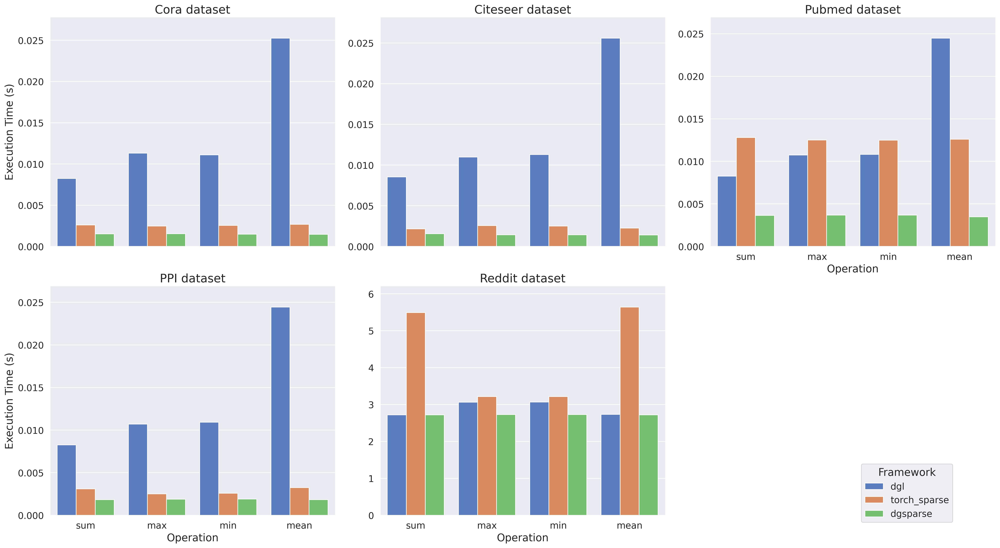

# dgSPARSE Library

[](https://opensource.org/licenses/MIT)
[](https://github.com/dgSPARSE/dgSPARSE-Lib/releases/)

## Introdution

The dgSPARSE Library (Deep Geometric Sparse Library) is a high performance library for sparse kernel acceleration on GPUs based on CUDA. Now we aims to provide PyTorch-Based Fast and Efficient Processing kernel for users to have better experience in running applications like GNN, Rec sys and 3D pointcloud detection.

## Installation

First, setup the the following environment variables:

```bash
export CUDA_HOME=/usr/local/cuda # your cuda path
export LD_LIBRARY_PATH=$CUDA_HOME/lib64 # your cuda lib path
```

Then, install with conda.

```bash
conda install -c dgsparse dgsparse
```

Or you can build from source

```bash
pip install -e .
```

A demo for SpMM inference time compared to other main-stream library. (Tested on RTX 3090 with feature=64).


## Run Examples

Previously we provide C++ examples for SpMM and SDDMM kernels.
To run these examples, please build dgsparse through `make exp`.
Then, you could run our kernels in the example folder. Check more details in README under example directory.

## Documentation

Our new docs for python API will be coming soon!
Now you can refer to [dgSPARSE Library Documentation](https://dgsparse.github.io/dgSPARSE-doc/) for more details.
